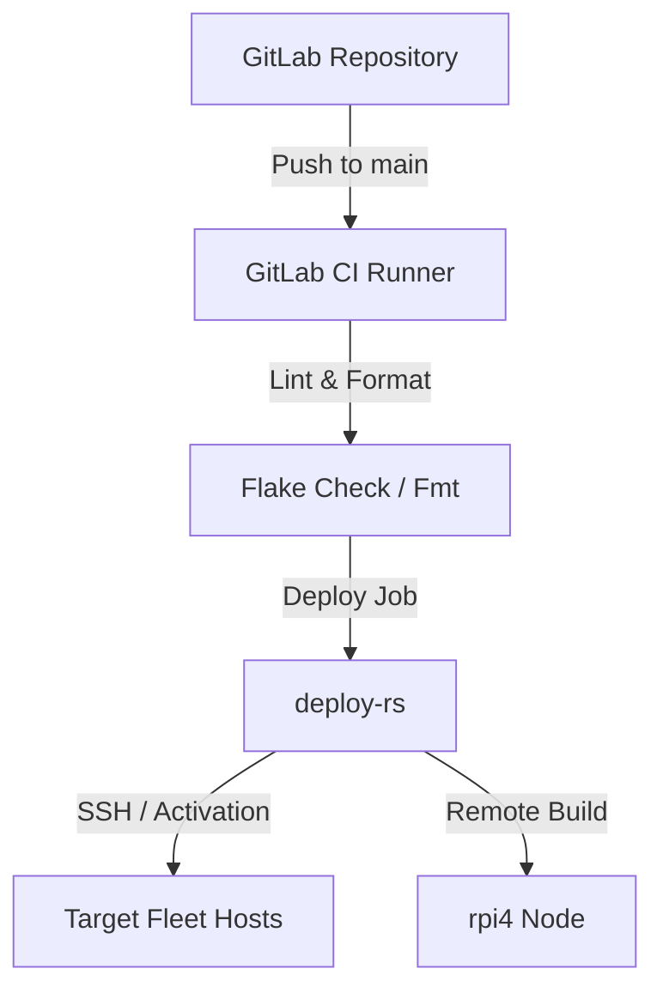

# Deployments

This document describes how the `nixos-fleet` configuration is built, verified, and deployed to target hosts.

## Deployment Architecture

System deployments are managed using **deploy-rs** (a multi-profile NixOS deployment tool developed by Serokell) and
driven by a GitLab CI pipeline.



## deploy-rs Configuration

Targets are defined inside the `deploy.nodes` attribute in [flake.nix](../flake.nix).

### Common Node Settings

Each node profile contains:

- `hostname`: The MagicDNS Tailscale host name (e.g., `proxmox-gitlab`, `xcloud-postgres`).
- `sshUser`: `root` (requires root permissions to execute `nixos-rebuild` activation scripts).
- `sshOpts`: `["-A"]` to forward the SSH agent.
- `path`: The compiled system profile from `nixosConfigurations.<hostname>`.

### Special Cases

- **Raspberry Pi 4 (`rpi4`)**:
    - `remoteBuild = true` is set.
    - This ensures that the closure is compiled on the CI builder (which runs on `proxmox-gaming` with multi-arch
      translation) rather than compiling on the resource-constrained Raspberry Pi CPU.
    - The compiled Nix path is copied directly over the network to the Pi.

## CI/CD Pipeline

The GitLab CI configuration is defined in [.gitlab-ci.yml](../.gitlab-ci.yml).

### 1. Test Stage

Every commit runs:

- **Lint**: Runs `nix flake check` to evaluate all nodes and nix configurations.
- **ARM64 Check**: Explicitly evaluates the ARM64 target's derivation path to catch evaluation issues before deployment:
  ```bash
  nix eval .#nixosConfigurations.rpi4.config.system.build.toplevel.drvPath
  ```
- **Format**: Runs `nix fmt -- --ci` to check style compliance.

### 2. Deploy Stage

Triggered on commits merged to the `main` branch.

- **SSH Configuration & Multiplexing**:
    - Injects the deployment SSH key from the masked variable `$SSH_PRIVATE_KEY` into `~/.ssh/id_ed25519`.
    - Configures strict key checking limits to known host targets to prevent man-in-the-middle issues.
    - Enables **SSH Connection Multiplexing** to speed up build copying:
      ```ssh-config
      ControlMaster auto
      ControlPath ~/.ssh/ssh-%r@%h:%p
      ControlPersist 10m
      ```
- **Execution**:
    - Runs `nix develop -c deploy --targets ".#<host>" --debug-logs --skip-checks`.
    - Deployments run concurrently across separate GitLab CI jobs.
- **Gaming Workstation (`gaming`)**:
    - Marked as `manual` and `allow_failure: true` because the workstation might be shut down or in active use by the
      user, requiring a manual deployment step.
