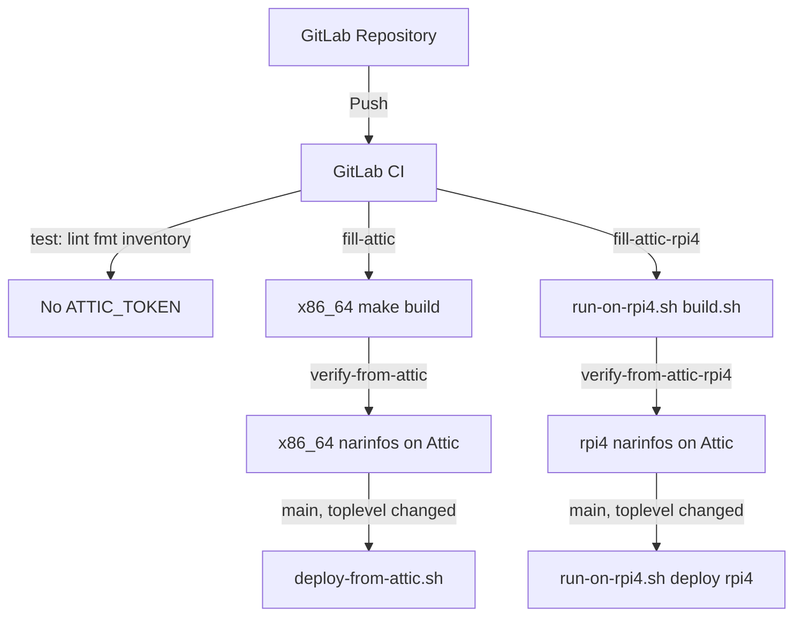

# Deployments

This document describes how the `nixos-fleet` configuration is built, verified, and deployed to target hosts.

## Deployment Architecture

Production activations **fill Attic first** (copy from `cache.nixos.org` if a
NAR is missing), then copy each host closure **from Attic only** and run
`switch-to-configuration`. After fill, the builder does not use the public
cache. Deployed hosts substitute only `http://proxmox-dev:8080/attic`. Attic
is an accepted SPOF for deploys.

`deploy-rs` remains in the flake and as `make deploy-rs` (magicRollback, copy from the
builder store). It is not the production path. `make deploy` includes `gaming` and copies that closure from Attic
too; `make reboot-all` still skips it so a fleet reboot does not take down the usual builder.


```mermaid
graph TD
    GitLab[GitLab Repository] -->|Push| CI[GitLab CI]
    CI -->|test: lint fmt inventory| Test[No ATTIC_TOKEN]
    CI -->|fill-attic| Fill[x86_64 make build]
    CI -->|fill-attic-rpi4| FillPi[run-on-rpi4.sh build.sh]
    Fill -->|verify-from-attic| Prove[x86_64 narinfos on Attic]
    FillPi -->|verify-from-attic-rpi4| ProvePi[rpi4 narinfos on Attic]
    Prove -->|main, toplevel changed| Deploy[deploy-from-attic.sh]
    ProvePi -->|main, toplevel changed| DeployPi[run-on-rpi4.sh deploy rpi4]
```

## Operator commands

`ATTIC_TOKEN` is required for build and deploy. Mint one with `atticadm make-token` on `proxmox-dev` (pull and push
on the `attic` cache) and export it.

```bash
make lint
make fmt-check
make check-inventory
make build                                          # fill current-system (x86_64) hosts + tooling into Attic
make build-rpi                                      # same, natively on rpi4
make verify-from-attic                              # narinfo-check current-system tooling + hosts on Attic
make verify-from-attic-rpi                          # same for rpi4, on the Pi
make deploy-from-attic HOST=proxmox-dev             # fill this host, exclusive realize, copy-from-Attic, switch
make deploy-rpi                                     # fill/switch rpi4 on the Pi (scripts/run-on-rpi4.sh)
make deploy-proxmox-host                            # Ansible: Proxmox VE hypervisor (not NixOS)
make deploy                                         # production fleet including gaming; rpi4 via run-on-rpi4.sh
make deploy-gaming                                  # same path, gaming only
make deploy-rs                                      # fallback: deploy-rs nix-copy from the builder
make bench-jellyfin-io                              # 4K Jellyfin I/O bench on apps-1 (build on proxmox-dev; BENCH_CMD=directplay)
```

[`scripts/deploy-from-attic.sh`](../scripts/deploy-from-attic.sh) fills the host
and operator tooling (`.#attic`, `.#ci-tools`, the default devShell) with builder substituters
if needed, pushes with `--ignore-upstream-cache-filter` (`ATTIC_PUSH_JOBS`,
default 8; Garage LMDB), proves the closure is in Attic, then copies onto the
host from Attic only (`attic_copy_closure_to_ssh`, `narinfo-cache-negative-ttl 0`)
and `switch-to-configuration`. If `/run/current-system` already matches the
host toplevel, the script exits 0 without switching (`ATTIC_FORCE_SWITCH=1`
to override). GitLab deploy jobs set `ATTIC_SKIP_FILL=1` after verify. The target
does not receive the closure from the
builder store. Scripts realize `.#attic` themselves; they do not wrap in
`nix develop`. Deploy the db hosts first:
[runbooks/garage-lmdb.md](runbooks/garage-lmdb.md).

See [adr/2026-08-30-attic-fill-then-exclusive.md](adr/2026-08-30-attic-fill-then-exclusive.md).

## deploy-rs Configuration (fallback)

Targets are defined inside the `deploy.nodes` attribute in [flake.nix](../flake.nix).

Nodes are constructed by a `mkNode` helper so these settings are declared once rather than repeated per host:

- `hostname`: The MagicDNS Tailscale host name (e.g., `proxmox-applications-2`, `xcloud-postgres`).
- `sshUser`: `root`.
- `sshOpts`: ControlMaster multiplexing plus `IdentitiesOnly` and the repo `ssh/fleet_known_hosts`.
- `path`: The compiled system profile from `nixosConfigurations.<hostname>`.
- `magicRollback`: `true` by default.
- `remoteBuild`: `true` by default. Copy-from-Attic deploys do not use this flag; the target never compiles.

Hosts that set `remoteBuild = false` (still relevant for a deploy-rs fallback): `xcloud-caddy`, `xcloud-postgres`,
`proxmox-lb`, the application and observability VMs, and `rpi4`. Production rpi4 activation is
[`scripts/run-on-rpi4.sh`](../scripts/run-on-rpi4.sh), not qemu on `proxmox-dev`. `proxmox-dev`, `proxmox-db-1`,
`proxmox-db-2`, and `gaming` still default to `remoteBuild = true` if you invoke deploy-rs without copying from Attic
first.

## CI/CD Pipeline

The GitLab CI configuration is defined in [.gitlab-ci.yml](../.gitlab-ci.yml).
GitHub [`.github/workflows/lint.yml`](../.github/workflows/lint.yml) is lint-only.
See [adr/2026-08-29-gitlab-ci-of-record.md](adr/2026-08-29-gitlab-ci-of-record.md).
Local vs GitLab is in [Local vs GitLab](#local-vs-gitlab) below. See
[adr/2026-08-31-gitlab-ci-pipeline.md](adr/2026-08-31-gitlab-ci-pipeline.md).

### 1. Test Stage

One job, no `ATTIC_TOKEN` (`needs: []`):

- [`scripts/lint.sh`](../scripts/lint.sh) (`nix flake check --all-systems --no-build`)
- `make fmt-check` (`nix fmt -- --ci`)
- [`scripts/check-inventory.sh`](../scripts/check-inventory.sh)

### 2. Build Stage (`fill-attic` / `fill-attic-rpi4`)

Requires `ATTIC_TOKEN`. `ATTIC_SKIP_IF_CACHED=1`. Skipped on docs-only
commits (`rules:changes`). `fill-attic` fills **x86_64** tooling and hosts on
the proxmox-dev runner (uncached hosts in one `nix build`). `fill-attic-rpi4`
copies the checkout onto the Pi and runs `build.sh` there (native aarch64). Do
not set `extra-platforms` or install `qemu-user-static` in the job; that path
dies with `Exec format error`. rpi4 jobs `allow_failure` so a down Pi does not
block x86 deploys. Fill may still use `cache.nixos.org`. After fill, verify
and deploy do not.
NAR fetch uses **`http://proxmox-dev:8080/attic`**, not the LB. Tooling
(`packages.attic`, `packages.ci-tools`, the default devShell) is filled with
the hosts. Fill jobs are `interruptible` and use `resource_group` so a newer
pipeline cancels an in-flight fill instead of stacking two on Garage.

### 3. Verify Stage

[`scripts/verify-from-attic.sh`](../scripts/verify-from-attic.sh) checks
narinfos for current-system operator tooling and hosts at proxmox-dev. It does not
download NARs. x86 deploy jobs `needs` `verify-from-attic`.
`verify-from-attic-rpi4` does the same on the Pi for `rpi4`.

### 4. Deploy Stage

Triggered on commits merged to the `main` branch when Nix/lockfile/scripts/secrets
changed (docs-only skips this stage).

- Injects `$SSH_PRIVATE_KEY`, pins [`ssh/fleet_known_hosts`](../ssh/fleet_known_hosts), `StrictHostKeyChecking yes`.
- x86 hosts: [`scripts/deploy-from-attic.sh`](../scripts/deploy-from-attic.sh) with `CI_ENVIRONMENT_NAME` and `ATTIC_SKIP_FILL=1`.
- A host already on the evaluated toplevel is not switched.
- **`rpi4`**: [`scripts/run-on-rpi4.sh`](../scripts/run-on-rpi4.sh) `deploy-from-attic.sh rpi4`. `allow_failure`.
- **Gaming** stays `manual` / `allow_failure` and uses the same Attic script as `make deploy-gaming`.

Regenerate known_hosts with [`scripts/update-known-hosts.sh`](../scripts/update-known-hosts.sh) after any host key
change.

## Proxmox hypervisor (Ansible)

The VE host is not a flake target. Apply it with `make deploy-proxmox-host`
from [`ansible/`](../ansible/). See
[services/proxmox-host.md](services/proxmox-host.md) and
[adr/2026-08-31-proxmox-ansible.md](adr/2026-08-31-proxmox-ansible.md).
That path does not use Attic.

## Operator machine

Edits land on the Darwin checkout. **x86_64 Attic builds and deploys run on
`root@proxmox-dev`.** aarch64 runs on `root@rpi4` via
[`scripts/run-on-rpi4.sh`](../scripts/run-on-rpi4.sh). Do not fill or
`deploy-from-attic` from the laptop store or from `gaming`.

```bash
rsync -az --delete --exclude='.git/' --exclude='result' --exclude='.direnv/' \
  /Users/alex/code/nixos-fleet/ root@proxmox-dev:/root/nixos-fleet-deploy/
ssh root@proxmox-dev 'bash -s' << 'EOF'
set -euo pipefail
export ATTIC_TOKEN=$(cat /root/.attic-token)
export ATTIC_CACHE_URL="http://proxmox-dev:8080/attic"
export PATH="/run/current-system/sw/bin:/nix/var/nix/profiles/default/bin:$PATH"
cd /root/nixos-fleet-deploy
./scripts/deploy-from-attic.sh <host>
EOF
```

rpi4 (native aarch64; do not fill this host on proxmox-dev):

```bash
./scripts/run-on-rpi4.sh ./scripts/deploy-from-attic.sh rpi4
```

`--exclude='.git/'` means the copy is a path flake: every file on disk is
visible (including untracked). A `nix` eval **in this git checkout** only sees
tracked files — `git add` new Nix/Go/Python that a module references or lint
fails.

## Local vs GitLab

| | Local | GitLab |
|---|---|---|
| Nix | already installed on proxmox-dev / rpi4 | `nixos/nix` image + `.#ci-tools`; rpi4 jobs SSH to the Pi |
| `ATTIC_TOKEN` | `/root/.attic-token` or env | CI variable |
| SSH | operator keys + `ssh/fleet_known_hosts` | `SSH_PRIVATE_KEY` CI variable |
| Fill (x86_64) | `make build` on proxmox-dev | `fill-attic` with `ATTIC_SKIP_IF_CACHED=1` |
| Fill (aarch64) | `make build-rpi` | `fill-attic-rpi4` → `run-on-rpi4.sh build.sh` |
| Prove | `make verify-from-attic` / `make verify-from-attic-rpi` | narinfo check after fill |
| Deploy | `deploy-from-attic.sh` (x86); `run-on-rpi4.sh` (rpi4) | `ATTIC_SKIP_FILL=1`; skip switch if toplevel matches; `gaming` is manual |

The `test` job (`lint` + `fmt-check` + `check-inventory`) uses `needs: []` so it
does not wait on `ATTIC_TOKEN`. Docs-only commits skip fill/verify/deploy.
GitHub Actions is lint-only and has no tailnet.

## Scripts

Scripts load `/root/.attic-token` when `ATTIC_TOKEN` is unset; they refuse to
start a fill or deploy if both are missing.

| Script | Make target | Notes |
|---|---|---|
| [scripts/attic-common.sh](../scripts/attic-common.sh) | (sourced) | fill vs exclusive helpers; `ATTIC_PUSH_JOBS`, `ATTIC_SKIP_IF_CACHED` |
| [scripts/lint.sh](../scripts/lint.sh) | `make lint` | |
| [scripts/check-inventory.sh](../scripts/check-inventory.sh) | `make check-inventory` | needs `python3` (in the flake devShell) |
| [scripts/check-secrets.sh](../scripts/check-secrets.sh) | `make check-secrets` | age key; **not CI** |
| [scripts/build.sh](../scripts/build.sh) | `make build` | fill currentSystem only; `ATTIC_SKIP_IF_CACHED=1`, `ATTIC_TOOLING_ONLY=1` |
| [scripts/run-on-rpi4.sh](../scripts/run-on-rpi4.sh) | `make build-rpi` / `make deploy-rpi` | copy checkout to the Pi; run fill/verify/deploy there |
| [scripts/verify-from-attic.sh](../scripts/verify-from-attic.sh) | `make verify-from-attic` | narinfo check at `http://proxmox-dev:8080/attic` |
| [scripts/deploy-from-attic.sh](../scripts/deploy-from-attic.sh) | `make deploy-from-attic HOST=` | fill, then exclusive copy; `ATTIC_SKIP_FILL=1`, `ATTIC_SKIP_TOOLING=1`, `ATTIC_FORCE_SWITCH=1`, `ATTIC_COPY_FROM_BUILDER=1` |
| [scripts/nix-develop.sh](../scripts/nix-develop.sh) | | fill the shell, then Attic-only `nix develop` when `ATTIC_TOKEN` is set |
| [scripts/attic-push.sh](../scripts/attic-push.sh) | | batched push; used if you already have a store path |
| [scripts/update-known-hosts.sh](../scripts/update-known-hosts.sh) | `make update-known-hosts` | from a trusted workstation `known_hosts` |

`make edit-secrets HOST=` / `make updatekeys` for sops. Ansible
(`make deploy-proxmox-host`) is not Nix; see
[services/proxmox-host.md](services/proxmox-host.md).

## Rollback

Every activation leaves a NixOS generation on the host. To walk one back, or to
recover a host that stopped answering SSH, see
[runbooks/rollback.md](runbooks/rollback.md). `make reboot-all` iterates
`PROD_HOSTS` and is a reboot, not a rollback.
