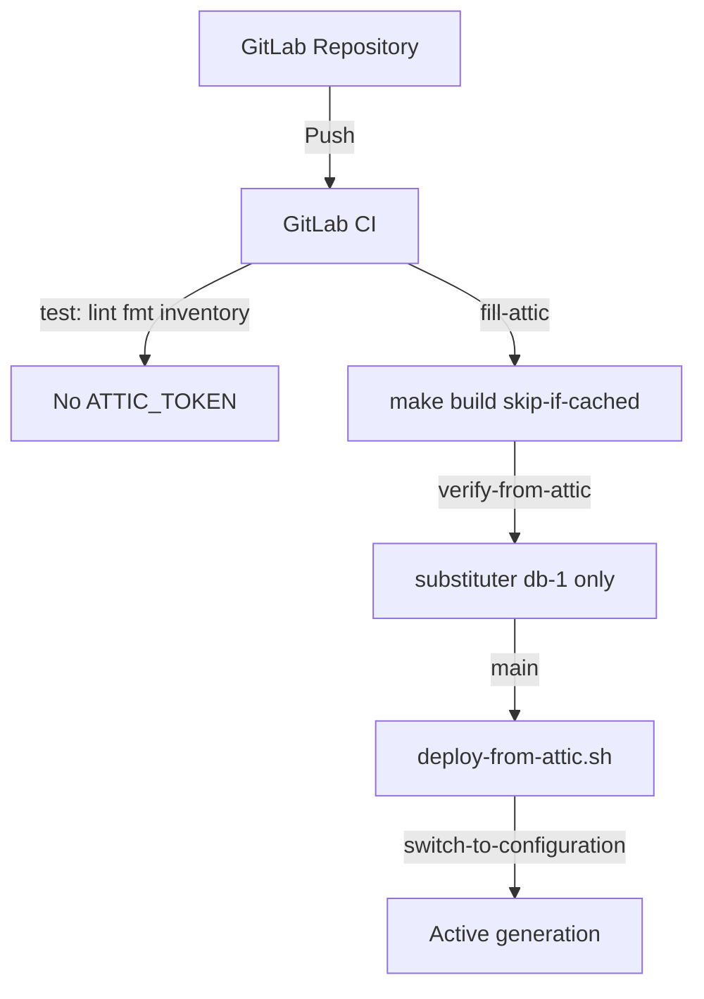

# Deployments

This document describes how the `nixos-fleet` configuration is built, verified, and deployed to target hosts.

## Deployment Architecture

Production activations **fill Attic first** (copy from `cache.nixos.org` if a
NAR is missing), then copy each host closure **from Attic only** and run
`switch-to-configuration`. After fill, the builder does not use the public
cache. Deployed hosts substitute only `http://proxmox-db-1:8080/attic`. Attic
is an accepted SPOF for deploys.

`deploy-rs` remains in the flake and as `make deploy-rs` (magicRollback, copy from the
builder store). It is not the production path. `make deploy` includes `gaming` and copies that closure from Attic
too; `make reboot-all` still skips it so a fleet reboot does not take down the usual builder.


```mermaid
graph TD
    GitLab[GitLab Repository] -->|Push| CI[GitLab CI]
    CI -->|test: lint fmt inventory| Test[No ATTIC_TOKEN]
    CI -->|fill-attic| Fill[make build skip-if-cached]
    Fill -->|verify-from-attic| Prove[substituter db-1 only]
    Prove -->|main| Deploy[deploy-from-attic.sh]
    Deploy -->|switch-to-configuration| Live[Active generation]
```

## Operator commands

`ATTIC_TOKEN` is required for build and deploy. Mint one with `atticadm make-token` on `proxmox-db-1` (pull and push
on the `attic` cache) and export it.

```bash
make lint
make fmt-check
make check-inventory
make build                                          # fill current-system hosts + tooling into Attic
make verify-from-attic                              # realize tooling + every host from Attic only
make deploy-from-attic HOST=proxmox-dev             # fill this host, exclusive realize, copy-from-Attic, switch
make deploy-proxmox-host                            # Ansible: Proxmox VE hypervisor (not NixOS)
make deploy                                         # production fleet including gaming; skips rpi4 if it does not answer
make deploy-gaming                                  # same path, gaming only
make deploy-rs                                      # fallback: deploy-rs nix-copy from the builder
```

[`scripts/deploy-from-attic.sh`](../scripts/deploy-from-attic.sh) fills the host
and operator tooling (`.#attic`, the default devShell) with builder substituters
if needed, pushes with `--ignore-upstream-cache-filter` (`ATTIC_PUSH_JOBS`,
default 8; Garage LMDB), proves the closure is in Attic, then copies onto the
host from Attic only (`attic_copy_closure_to_ssh`, `narinfo-cache-negative-ttl 0`)
and `switch-to-configuration`. The target does not receive the closure from the
builder store. Scripts realize `.#attic` themselves; they do not wrap in
`nix develop`. Deploy the db hosts first:
[runbooks/garage-lmdb.md](runbooks/garage-lmdb.md).

See [adr/2026-08-30-attic-fill-then-exclusive.md](adr/2026-08-30-attic-fill-then-exclusive.md).

## deploy-rs Configuration (fallback)

Targets are defined inside the `deploy.nodes` attribute in [flake.nix](../flake.nix).

Nodes are constructed by a `mkNode` helper so these settings are declared once rather than repeated per host:

- `hostname`: The MagicDNS Tailscale host name (e.g., `proxmox-applications-2`, `xcloud-postgres`).
- `sshUser`: `root`.
- `sshOpts`: ControlMaster multiplexing plus `IdentitiesOnly` and the repo `ssh/fleet_known_hosts`.
- `path`: The compiled system profile from `nixosConfigurations.<hostname>`.
- `magicRollback`: `true` by default.
- `remoteBuild`: `true` by default. Copy-from-Attic deploys do not use this flag; the target never compiles.

Hosts that set `remoteBuild = false` (still relevant for a deploy-rs fallback): `xcloud-caddy`, `xcloud-postgres`,
`proxmox-lb`, the application and observability VMs, and `rpi4`. `proxmox-dev`, `proxmox-db-1`, `proxmox-db-2`, and
`gaming` still default to `remoteBuild = true` if you invoke deploy-rs without copying from Attic first.

## CI/CD Pipeline

The GitLab CI configuration is defined in [.gitlab-ci.yml](../.gitlab-ci.yml).
GitHub [`.github/workflows/lint.yml`](../.github/workflows/lint.yml) is lint-only.
See [adr/2026-08-29-gitlab-ci-of-record.md](adr/2026-08-29-gitlab-ci-of-record.md)
and [AGENTS.md](../AGENTS.md) for CI vs local diffs (Determinate Nix in the job
image; tokens from CI variables vs `/root/.attic-token`).

### 1. Test Stage

Runs without `ATTIC_TOKEN` (`needs: []`):

- **Lint**: [`scripts/lint.sh`](../scripts/lint.sh)
- **Inventory**: [`scripts/check-inventory.sh`](../scripts/check-inventory.sh)
- **Format**: `make fmt-check` (`nix fmt -- --ci`)

### 2. Build Stage (`fill-attic`)

Requires `ATTIC_TOKEN`. `ATTIC_SKIP_IF_CACHED=1` and `ATTIC_BUILD_ALL_SYSTEMS=1`
so already-cached closures are skipped and `rpi4` is built via `qemu-user-static`.
Fill may still use `cache.nixos.org`. After fill, verify and deploy do not.
NAR fetch uses **`http://proxmox-db-1:8080/attic`**, not the LB. Tooling
(`packages.attic`, the default devShell) is filled with the hosts.

### 3. Verify Stage

[`scripts/verify-from-attic.sh`](../scripts/verify-from-attic.sh) realizes
operator tooling and every host with substituters **only** db-1, `--max-jobs 0`,
`fallback false`. Deploy jobs `needs` this job.

### 4. Deploy Stage

Triggered on commits merged to the `main` branch.

- Injects `$SSH_PRIVATE_KEY`, pins [`ssh/fleet_known_hosts`](../ssh/fleet_known_hosts), `StrictHostKeyChecking yes`.
- Runs [`scripts/deploy-from-attic.sh`](../scripts/deploy-from-attic.sh) with `CI_ENVIRONMENT_NAME` as the hostname.
- **Gaming** stays `manual` / `allow_failure` and uses the same Attic script as `make deploy-gaming`.

Regenerate known_hosts with [`scripts/update-known-hosts.sh`](../scripts/update-known-hosts.sh) after any host key
change.

## Proxmox hypervisor (Ansible)

The VE host is not a flake target. Apply it with `make deploy-proxmox-host`
from [`ansible/`](../ansible/). See
[services/proxmox-host.md](services/proxmox-host.md) and
[adr/2026-08-31-proxmox-ansible.md](adr/2026-08-31-proxmox-ansible.md).
That path does not use Attic.

## Rollback

Every activation leaves a NixOS generation on the host. To walk one back, or to
recover a host that stopped answering SSH, see
[runbooks/rollback.md](runbooks/rollback.md). `make reboot-all` iterates
`PROD_HOSTS` and is a reboot, not a rollback.
