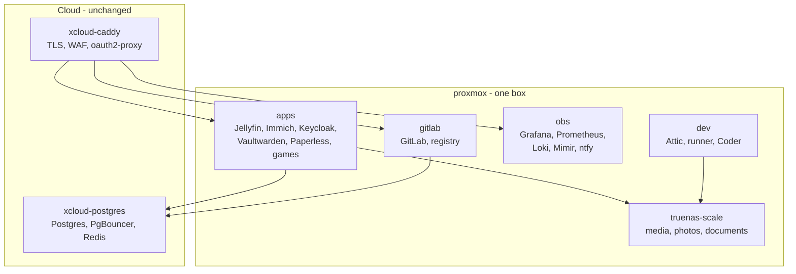

# Fleet simplification plan

A phased proposal to reduce the on-premises fleet from nine guests pretending
to be a cluster down to five guests sized for one hypervisor, without losing a
service.

## Status

**In progress.** Phase 0 is in the tree (interim backup relay on
`proxmox-dev`). Phases 2, 4, and 5 (keep Garage as a single node; no
internal LB; Keycloak and Vikunja on apps-1) are accepted:

- [Observability is one VM](adr/2026-09-07-observability-monolith.md)
- [Garage on obs-1](adr/2026-09-07-garage-on-obs-1.md)
- [No internal load balancer](adr/2026-09-07-no-internal-lb.md)

The observability guest is named `proxmox-observability` (no `-1`).
VMs 104, 105, 107, and 108 were destroyed on 2026-09-07. Live guests
are 100–103 and 106. Cutover:
[runbooks/observability-monolith.md](runbooks/observability-monolith.md).
LB retirement: [runbooks/retire-proxmox-lb.md](runbooks/retire-proxmox-lb.md).

Phase 3 as written (retire Garage for filesystem backends) is **not**
chosen. Phase 1 (local VM disks) is **declined** until hardware is
installed ([nfs-vm-roots](adr/2026-09-07-nfs-vm-roots.md)). Three hubs
stay SPOFs ([no internal LB](adr/2026-09-07-no-internal-lb.md)).

Read this next to [`adr/2026-08-29-four-hubs.md`](adr/2026-08-29-four-hubs.md).
That ADR already accepts four single points of failure. This plan argues the
list is incomplete and that several of the replica pairs standing next to those
hubs cost more reliability than they buy.

## Evidence

Measured on the live fleet on 2026-09-07 between 09:00 and 09:20 SAST, roughly
45 minutes after a hypervisor boot, with a TrueNAS `hdd` scrub running.
Everything in the Findings section below is from that inspection; nothing is
inferred from the docs alone.

### Hypervisor

| Property | Value |
|----------|-------|
| Board / BIOS | Gigabyte `B860I AORUS PRO ICE` (Mini-ITX), AMI `F6`, 2025-03-11 |
| CPU | Intel Core Ultra 5 225 — 6 P-cores (`cpu0-5`, 5.0 GHz) + 4 E-cores (`cpu6-9`, 4.5 GHz), no SMT |
| RAM | 93.8 GiB; `Committed_AS` 88.6 GB; `MemAvailable` 11.6 GiB |
| PVE | 9.2.11, kernel `7.0.14-15-pve` |
| Boot / VM disk | one 238 GiB `256GB PCIe SSD` (MAXIO MAP1202, DRAM-less) |
| Pass-through disks | 2x Seagate 23.6 TB, 2x WD Blue SA510 1 TB — all to VM 100 |
| Load | 8.3 / 8.5 / 8.6 on 10 cores |
| Package temp | 74 °C rising to 84 °C (trip 85 °C), `package_throttle_count` 28 |
| ACPI BERT | 1 fatal error record captured for the previous boot |

### Guests

| VM | Role | vCPU | RAM | Root disk |
|----|------|------|-----|-----------|
| 100 `truenas-scale` | NAS, NFS, ZFS | 4, pinned `affinity: 6-9` | 24 GiB | `local-lvm` |
| 101 `proxmox-applications-1` | media, identity, docs, games, iGPU | 4 | 12 GiB | NFS qcow2 |
| 102 `proxmox-applications-2` | GitLab, registry, Keycloak, Vikunja | 4 | 12 GiB | NFS qcow2 |
| 103 `proxmox-observability-1` | Grafana, Prometheus, Loki, Mimir, ntfy | 2 | 4 GiB | NFS qcow2 |
| 104 `proxmox-observability-2` | same stack again | 2 | 4 GiB | NFS qcow2 |
| 105 `proxmox-lb` | internal Caddy | 2 | 1 → 2 GiB | NFS qcow2 |
| 106 `proxmox-dev` | Attic, Coder, GitLab runner | 4 | 16 GiB | NFS qcow2 |
| 107 `proxmox-db-1` | Garage | 2 | 2 GiB | NFS qcow2 |
| 108 `proxmox-db-2` | Garage | 2 | 2 GiB | NFS qcow2 |

Totals: **26 vCPU on 10 cores, ~79 GiB of 94 GiB.**

## Findings

### 1. The storage dependency is circular

Every NixOS guest boots from a qcow2 on `truenas-storage`, which is
`truenas-scale:/mnt/ssd/proxmox/storage-pool` — an NFS export served by VM 100,
which is itself a guest of the same hypervisor. VM 100's own root disk is the
only one on `local-lvm`.

So the boot order is: hypervisor, then VM 100, then NFS, then everything else.
A TrueNAS hang does not degrade the fleet, it freezes the root filesystem of
seven VMs. This is the single largest structural risk on the box, and it is not
in the four-hubs ADR.

### 2. The one NVMe is the most likely hardware failure

`nvme0n1` is an unbranded DRAM-less controller holding `pve-root`, host swap,
and VM 100's boot disk. SMART:

- `Percentage Used` 21% at only 1578 power-on hours
- `Data Units Written` 27.8 TB (~420 GB/day)
- `Critical Comp. Temperature Time` **64 minutes**, warning time 10 minutes

If it dies, the hypervisor and the NAS VM die together, and with the NAS VM the
storage for every other guest. There is no second copy of `pve-root`. Nothing
currently alerts on NVMe wear or composite temperature.

### 3. Replica pairs do not survive the thing that actually fails

There are four paired workloads on this host. All four share one CPU, one
power supply, one NVMe, and one NFS server:

- `proxmox-db-1` / `-2` run Garage `replication_factor = 2`, but both data
  directories are datasets on the **same** TrueNAS `ssd` mirror
  (`ssd/garage/data` 23.4 GiB and `ssd/garage/data-replica-1` 23.9 GiB).
  Zone redundancy is `maximum`, so both VMs must be up to accept writes. The
  pair converts "one VM reboots" into "S3 is read-only" and gives no protection
  against pool or NAS loss.
- `proxmox-observability-1` / `-2` each run a full Grafana, Prometheus, Loki,
  Mimir, and ntfy. Loki and Mimir are both `replication_factor = 1`, so the
  second copy is not a durability replica; it is a second scraper writing a
  second copy of the same series. Paging already depends on obs-1 alone
  ([ntfy single writer](adr/2026-09-04-ntfy-json-priority-single-writer.md)).
- Keycloak clusters over JGroups between apps-1 and apps-2, and `flake.nix`
  runs a `co-routed-peers` check to keep the package versions in lockstep — for
  two JVMs (512 MB and 611 MB RSS) on one motherboard.
- `proxmox-lb` is a single VM in front of all of it, so every pair's failover
  still funnels through one unreplicated hop.

### 4. `proxmox-lb` at 1 GiB was the outage during this inspection

At 09:03 the LB was serving HTTP but had no working QEMU guest agent and its
SSH banner timed out over both the LAN and the tailnet. QEMU `blockstat`
reported **648 GiB read in 42 minutes** from a 35 GiB disk, with
`rd_total_time_ns` of 166,527 seconds — a thrashing VM, not a busy one. It was
resized to 2 GiB and restarted during the inspection window and is now healthy
(668 MiB used, load 1.11, `caddy` and `qemu-guest-agent` active).

A 1 GiB VM running Caddy, `tailscaled`, Alloy, and five exporters with active
health checks against ten backends was undersized. Note that raising it to
2 GiB spends the RAM that the pair-of-everything design was supposed to save.

### 5. TrueNAS is pinned to the slow cores

VM 100 has `affinity: 6-9`. Cores 6-9 are the E-cores (`cpu_capacity` 803 vs
1024, 4.5 GHz vs 5.0 GHz). The VM that every other guest's root filesystem
depends on is confined to the four slowest cores, at load average 7.8, while
scrubbing 17.8 TiB at 84 MB/s. It read 533 GiB and wrote 64 GiB in the 45
minutes after boot.

### 6. Documentation drift

- `README.md` describes `truenas-scale` as "Core NAS storage & hypervisor" with
  "Proxmox VE (Nested)". It is the reverse: Proxmox is on metal and TrueNAS is
  guest 100.
- [`memory.md`](memory.md) budgets the host as "~82 GiB VM RAM commit +
  `zfs_arc_max` ~9.4 GiB". The host has **no ZFS pools** — `arc_summary`
  reports a current ARC size of 2.3 KiB. All ZFS is inside VM 100 and is paid
  for out of its 24 GiB. The host has roughly 9 GiB more headroom than the doc
  claims.
- [`services/proxmox-host.md`](services/proxmox-host.md) and the networking
  role state MTU 9000 propagates to the SR-IOV VFs. In the guests, `eth0` is
  **MTU 1500** and `tailscale0` is 1280. Jumbo frames are not in effect where
  the storage traffic actually runs.

### 7. Small live defects

- `garage-bootstrap.service` on `proxmox-db-1` is `failed` since 08:24. It
  waited ~60 s for the daemon, gave up, and is never retried. Garage came up
  fine afterwards; the unit just stays red and will mask a real failure.
- KSM is enabled and sharing 1059 pages (~4 MiB). It is scanning for nothing.
- On obs-1, `grafana` sits at 594 MB against a 768 MB `MemoryMax` and
  `prometheus` at 689 MB against 1 GiB. Both are above 75% of cap on a 3.8 GiB
  VM. Two 4 GiB observability VMs are tighter than one 8 GiB VM would be.

### Corrections to earlier analysis

Three claims from the first pass did not hold up and are corrected here:

1. **"Move the VM root disks to `local-lvm`" does not fit.** The `local-lvm`
   thin pool is 141 GiB with ~116 GiB free, and the guests consume ~230 GiB of
   actual data (`dev` alone is 90 GiB). The pool sits on the same worn 238 GiB
   NVMe. This step needs new hardware; see Phase 1.
2. **Tailscale is not adding latency.** The 170–290 ms round trips measured at
   09:03 were the wedged LB, not the overlay. Measured after it recovered:
   LAN 0.11 ms, tailnet 0.47 ms, LB over tailnet 0.87 ms. The argument against
   NFS over Tailscale is the 1280-byte MTU against 1 MiB `rsize`/`wsize`, the
   userspace WireGuard CPU cost on a CPU-bound host, and making `tailscaled` a
   storage dependency — not latency.
3. **Garage is healthy right now.** `cluster_healthy 1`, `cluster_available 1`,
   two connected nodes across `dc1` and `dc2`. The case for collapsing it is
   that RF=2 on one physical mirror buys nothing, not that it is broken.

## Target architecture

Treat the hypervisor as the single failure domain it already is. Spend the
effort on recovering it quickly, not on replicas that share its power supply.

Five guests instead of nine. No `proxmox-lb`, no `proxmox-db-1`/`-2`, no
`proxmox-observability-2`. VM root disks on a dedicated NVMe; bulk and durable
data on the TrueNAS mirrors.

| | vCPU | RAM |
|---|------|-----|
| Now | 26 | ~79 GiB |
| Target | 18 | ~62–70 GiB |

The split to hold onto: **NVMe is fast and rebuildable** (VM root disks, Loki
chunks, Mimir blocks, the Attic cache — all reconstructible), **ZFS mirrors are
durable and snapshotted** (media, photos, documents, Vaultwarden data, Postgres
dumps).

## Phases

Run them in order. Each is independently useful and independently revertible,
and the ordering is a real dependency chain: `proxmox-lb` cannot be retired
until its backends stop being pairs.

Phase 0 and the staging for Phase 1 have an execution runbook:
[`runbooks/fleet-simplification-migration.md`](runbooks/fleet-simplification-migration.md).
It found that no ZFS snapshot or Proxmox backup job currently protects any
guest's disk, and that `rpi4` was unreachable with today's Postgres and
GitLab backups stuck unsynced — read it before running any command below.

Phases 1 and later change topology, so each one is a deploy. Docs-only edits
are not ([`deploy.mdc`](../.cursor/rules/deploy.mdc)).

---

### Phase 0 — Stabilise, change nothing structural

**Goal:** stop the current bleeding without touching topology. No ADR needed.

1. Reschedule the TrueNAS `hdd` scrub so it does not overlap a boot storm. It
   started Sunday 00:00 and was still running Monday 09:00 at 84 MB/s.
2. Repin VM 100 to P-cores (`affinity: 0-5`, or drop `affinity` entirely and
   let the scheduler place it). The storage VM should not be confined to the
   four slowest cores.
3. Leave `proxmox-lb` at 2 GiB until Phase 4 deletes it. Do not put it back to
   1 GiB.
4. Fix `garage-bootstrap.service`: raise the wait or add `Restart=on-failure`
   with a backoff, so a slow daemon start does not leave a permanently failed
   unit.
5. Add the missing hardware alerts, then a `fleet-hardware` panel for each
   ([`alerts-on-fix.mdc`](../.cursor/rules/alerts-on-fix.mdc),
   [`grafana-dashboards.mdc`](../.cursor/rules/grafana-dashboards.mdc)):
   - NVMe wear — `node_nvme_info_wearout` or the smartctl exporter's
     percentage-used series, warn well before 100%
   - NVMe composite temperature — this drive has already logged 64 minutes
     above critical
   - Vet both against live series first
     ([`alert-timeseries.mdc`](../.cursor/rules/alert-timeseries.mdc))
6. Correct the three documentation drifts in Finding 6: the README topology
   table, the host RAM budget in `memory.md`, and the MTU claim in
   `services/proxmox-host.md`. Either set the guest VFs to MTU 9000 or stop
   documenting jumbo frames.

**Risk:** low. **Rollback:** revert the commit; re-pin the VM.
**Done when:** no failed units on any guest, NVMe alerts firing against real
series, docs match `qm config` and `ip link`.

---

### Phase 1 — Break the circular storage dependency

**Status: declined for now.** Roots stay on TrueNAS NFS
([nfs-vm-roots](adr/2026-09-07-nfs-vm-roots.md)). Revisit when a drive is
installed.

**Goal:** VM root disks stop living on a filesystem served by a VM.

This is the highest reliability gain per unit of risk in the whole plan, and it
is a prerequisite for retiring TrueNAS-adjacent complexity later.

**It needs hardware.** The current NVMe cannot absorb the guests (Finding 1,
Correction 1). The B860I is Mini-ITX: the x16 slot holds the X710, all four
SATA ports are in use by the pass-through disks, and there is one free M.2
slot. Options, in preference order:

1. **Add one 2 TB M.2 NVMe** as `local-nvme` and make it the VM datastore.
   Cheapest, least disruptive, no ZFS surgery, no data migration off TrueNAS.
   A single drive is acceptable here because VM root disks are rebuildable from
   the flake — that is the whole point of NixOS. Replicate the few stateful
   paths to the ZFS mirrors nightly.
2. **Add two M.2 NVMe as a ZFS mirror** if the board exposes a second free
   slot. Better, if the slot exists.
3. **Reclaim the two WD Blue SA510s** from VM 100 into a host ZFS mirror. No
   purchase, but it is a live migration of 268 GiB including the `storage-pool`
   the VMs are currently running from, and it shrinks TrueNAS. Highest risk.

Steps for option 1:

1. Install the drive, create the datastore.
2. Move guests one at a time with `qm migrate --targetstorage`, or
   `qm stop` then `qm disk move`. Start with `proxmox-lb` and the db nodes
   (small, and least missed), finish with `proxmox-dev` (90 GiB).
3. Move VM 100's boot disk off the aging `local-lvm` too, so the NAS does not
   depend on the drive with 21% wear.
4. Leave media, photos, documents, and the Garage data dirs on TrueNAS. Only
   the root disks move.
5. Reduce host swap or keep it; it is unused (`0B` of 8 GiB).

**Risk:** medium — it is a disk move per VM, one reboot each.
**Rollback:** move the disk back; the qcow2 on NFS is untouched until you
delete it.
**Done when:** `qm config` for every guest points at the local datastore, and
the hypervisor can boot every VM with VM 100 stopped.
**ADR:** new record, "VM root disks are local; TrueNAS serves data only."

---

### Phase 2 — One observability VM

**Status: accepted.** See
[observability-monolith ADR](adr/2026-09-07-observability-monolith.md) and
[runbook](runbooks/observability-monolith.md).

**Goal:** delete `proxmox-observability-2`.

Two 4 GiB VMs each running five daemons, scraping the fleet twice, storing two
copies of series that are `replication_factor = 1` anyway, with paging already
pinned to obs-1. One 8 GiB VM is more reliable than two 4 GiB VMs on this box,
because it removes memberlist gossip, the Alertmanager cluster, the duplicate
scrape, and it gives Grafana and Prometheus real headroom above the caps they
are currently pressing against (Finding 7).

1. Raise obs-1 to 8 GiB and 4 vCPU; revisit the `MemoryMax` rows in
   [`memory.md`](memory.md) ([`memory-limits.mdc`](../.cursor/rules/memory-limits.mdc)).
2. Drop `clusterPeers` from the Alertmanager config and the `*-cluster-env`
   oneshots for the single-member case.
3. Remove `proxmox-observability-2` from `services/caddy-internal.nix` backends
   so the LB stops health-checking a host that is going away.
4. Stop and destroy VM 104. Remove it from `config/fleet-inventory.nix`, the
   `Makefile` lists, `flake.nix` `nixosConfigurations` and `deploy.nodes`,
   `ssh/fleet_known_hosts`, and `secrets/proxmox-observability-2/`
   ([`inventory-secrets.mdc`](../.cursor/rules/inventory-secrets.mdc)). Run
   `make check-inventory`.
5. Retire the alerts that become structurally false — anything asserting a
   two-member Loki ring, a two-member Alertmanager cluster, or scraping obs-2.
   Review *all* rules, not only the ones you touched.
6. Drop the obs half of the `co-routed-peers` check in `flake.nix`.

**Risk:** low-medium. Metrics and log history live in Garage and survive.
**Rollback:** the host definition is in git; redeploy the VM.
**Done when:** one Prometheus, one Mimir, one Loki, one Grafana, one ntfy; no
alert references obs-2; `make check-inventory` passes.
**ADRs superseded:** [blackbox on obs-1](adr/2026-09-06-blackbox-on-obs-1.md)
becomes trivially true; [ntfy single writer](adr/2026-09-04-ntfy-json-priority-single-writer.md)
loses its reason to exist.

---

### Phase 3 — Retire Garage

**Status: not chosen.** The accepted half-measure is a single Garage node on
obs-1 ([garage on obs-1](adr/2026-09-07-garage-on-obs-1.md)). The db VMs go
away; S3 and the landmines stay. The filesystem-backend path below remains a
future option.

**Goal (unselected):** delete Garage itself, not only the db VMs.

With one observability VM, Loki and Mimir have exactly one writer and one
reader. Both support a `filesystem` backend, and atticd supports local storage.
That removes an entire distributed object store — and with it the LMDB
migration, the merkle resync runbook, the "do not pin S3 clients" rule, the
"never `garage repair blocks`" landmine, and two VMs.

1. Point Loki and Mimir at local storage on the obs VM. Their data is
   reconstructible; size the disk for the 31-day Loki retention.
2. Point atticd at local storage on `proxmox-dev`. Re-fill from
   `cache.nixos.org` if that is simpler than migrating the bucket — the fill
   path already allows the public cache
   ([`2026-08-30-attic-fill-then-exclusive.md`](adr/2026-08-30-attic-fill-then-exclusive.md)).
3. Add a nightly ZFS replication or `rsync` of the Attic and Mimir directories
   to the TrueNAS `ssd` pool, so a failed NVMe is a restore rather than a
   rebuild.
4. Destroy VMs 107 and 108 and remove them from the six inventory locations.
5. Delete the `garage` scrape job, the Garage alert group, and the Garage
   dashboard. Delete `services/garage.nix`, the runbooks, and the
   `ssd/garage/*` datasets once you are confident.

**Risk:** medium. This one moves real data. Do it after Phase 1, so the
destination is a local NVMe rather than NFS.
**Rollback:** keep the `ssd/garage/*` datasets for a release cycle before
deleting them.
**Done when:** no host runs `garage`; Grafana, Loki, and Attic all serve from
local storage; the S3 landmines in
[`infrastructure.mdc`](../.cursor/rules/infrastructure.mdc) are deleted rather
than merely unused.
**ADRs superseded:** [Garage S3 via LB](adr/2026-08-30-garage-s3-lb.md),
[Garage LMDB](adr/2026-09-05-garage-lmdb-migration.md), and the storage half of
[Attic monolithic](adr/2026-08-29-attic-monolithic.md).

---

### Phase 4 — Retire `proxmox-lb`

**Status: accepted.** See
[no internal LB](adr/2026-09-07-no-internal-lb.md) and
[runbook](runbooks/retire-proxmox-lb.md).

After Phases 2 and 3, the internal Caddy balances nothing: Grafana, Keycloak,
Vikunja, Loki, Mimir, Alertmanager, and S3 are all single-backend. What remains
is one unreplicated hop in front of every public service, plus the `:8080`
Attic route that deploys already bypass because it truncates multi-chunk NARs.

1. Repoint the edge Caddy on `xcloud-caddy` from `proxmox-lb:80` to the
   backend hosts over the tailnet, keeping the `Host` header behaviour.
2. Move the UDP layer-4 routes for OpenArena (`27960`) and Luanti (`30000`)
   from the LB to the edge, pointed at the apps VM.
3. Update the Grafana datasources, Alloy's `loki.write`, and every
   `proxmox-lb:<port>` reference in `services/` and `docs/`.
4. Destroy VM 105 and remove it from the six inventory locations.
5. Delete `services/caddy-internal.nix`, `docs/services/caddy-internal.md`, and
   the `CaddyUpstreamUnhealthy` alerts that referenced its upstreams.

**Trade accepted:** the edge now knows backend hostnames, so moving a service
between VMs becomes an `xcloud-caddy` deploy. With one hypervisor and no HA
requirement, that is the correct trade — it is a config edit a few times a
year against a VM that is in the path of every request.

**Risk:** medium — it touches the public path. Do it in a quiet window and keep
the LB VM stopped-but-present for a week before destroying it.
**Rollback:** start VM 105 and revert the edge Caddy config.
**Done when:** no `proxmox-lb` reference remains outside historical ADRs.
**ADRs superseded:** [four hubs](adr/2026-08-29-four-hubs.md) drops from four
hubs to three.

---

### Phase 5 — Single-instance applications

**Status: accepted** as part of
[no internal LB](adr/2026-09-07-no-internal-lb.md). Keycloak and Vikunja
run on apps-1 only. `co-routed-peers` is deleted. `proxmox-applications-2`
stays the GitLab VM.

1. Keycloak on apps-1 only. Remove the JGroups configuration, the
   `KeycloakClusterWrongSize` alert, and the Keycloak half of
   `co-routed-peers`.
2. Vikunja on apps-1 only.
3. Keep `proxmox-applications-2` as the GitLab VM. Do **not** merge it into
   apps-1: GitLab is ~4.3 GiB of Ruby and Gitaly, and apps-1 owns the iGPU
   pass-through for Jellyfin QSV and Immich ML. Isolating GitLab's memory
   behaviour from the media stack is worth one VM. Consider renaming it
   `gitlab` once the pair naming is meaningless.

**Risk:** low. Both are already fronted by a single edge.
**Done when:** one Keycloak, one Vikunja; `co-routed-peers` is deleted or
reduced to nothing.

---

## What is explicitly not changing

Keep all of this. It already matches a reliable-homelab-without-HA posture:

- sops-nix, per-host secret files, and no secrets in the Nix store
- Attic fill-then-exclusive deploys and GitLab as CI of record
- WAF `DetectionOnly` and per-vhost oauth2-proxy, not fleet-wide forward-auth
- Keycloak `/admin` gated to the tailnet CIDR at the edge
- `xcloud-caddy` and `xcloud-postgres` as accepted cloud SPOFs — one edge, one
  database, which is the shape the on-premises side is being moved toward
- `rpi4` as a USB backup target and off the edge path
- The hypervisor staying on Ansible, with its vault local
- The hardware, VFIO, SR-IOV, and thermal telemetry from
  [`2026-09-07-hardware-and-vfio-monitoring.md`](adr/2026-09-07-hardware-and-vfio-monitoring.md).
  This plan adds NVMe alerts to it rather than replacing anything.

## Considered and rejected

- **Delete the TrueNAS VM and run ZFS on the host.** Tempting, and it was in
  the first draft of this plan. Rejected: it means rebuilding SMB shares,
  snapshot schedules, and replication for 17.8 TiB of media and photos, and the
  actual defect is not "TrueNAS is a VM" — it is "guest root disks live on a
  guest's filesystem". Phase 1 fixes that for the price of one M.2 drive and
  leaves TrueNAS doing the job it is good at. Revisit only if TrueNAS itself
  becomes the problem.
- **Add a second Proxmox node and cluster it.** That is production HA, which
  the fleet has explicitly declined. It also doubles the thermal and power
  budget in the same room.
- **Buy more RAM and keep all nine guests.** The box is at 88.6 GB committed of
  96 GB, but it is equally CPU- and thermal-constrained: 26 vCPU on 10 cores,
  package touching its 85 °C trip, 28 throttle events, and a BERT record from
  the previous boot. RAM alone does not fix a shared-fate topology.

Garage as a single node is **not** in this list: it was accepted
([garage on obs-1](adr/2026-09-07-garage-on-obs-1.md)).

## Open decisions for the operator

1. Which Phase 1 hardware option — one 2 TB NVMe, a mirrored pair, or reclaim
   the SATA SSDs? This gates everything after it.
2. Is the 84 °C package temperature under a normal boot storm acceptable, or
   does the cooling need attention before adding sustained load? The BERT
   record and the crash runbook suggest attention.
3. Should TrueNAS keep 24 GiB, or drop to 16 GiB once it is no longer serving
   VM root disks? That is 8 GiB back to the host.
4. Does anything actually consume the second Grafana, or is obs-2 purely
   defensive? **Answered:** obs-2 is gone
   ([observability-monolith](adr/2026-09-07-observability-monolith.md)).

## Related

- [`adr/README.md`](adr/README.md) — decision index
- [`deployments.md`](deployments.md) — build, fill, and switch mechanics
- [`memory.md`](memory.md) — RAM inventory, corrected by Finding 6
- [`runbooks/proxmox-hardware-crash.md`](runbooks/proxmox-hardware-crash.md) —
  triage for the crash class this plan reduces exposure to
- [`fleet-audit.md`](fleet-audit.md) — the investigation log, not the spec
